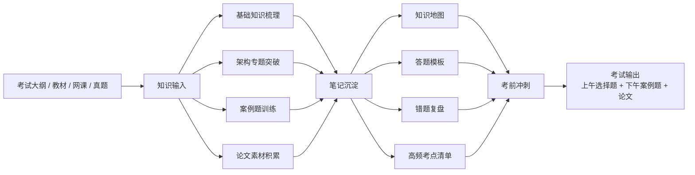

# 软考高级软件架构师备考指南

这是我个人用来备考软考高级软件架构师的学习仓库。

这个仓库的目标不是做成一套面向所有人的标准教程，而是把我在备考过程中的知识梳理、专题突破、真题训练、论文素材和复盘记录统一沉淀下来，形成一套可以持续迭代的个人备考体系。

## 备考目标

- 系统梳理高级软件架构师考试涉及的核心知识点，建立完整知识框架。
- 围绕架构设计、质量属性、设计模式、中间件、分布式、项目管理等重点专题做集中突破。
- 结合历年真题训练案例分析和论文写作能力，提升应试输出质量。
- 沉淀一套适合个人反复复习的笔记、模板、清单和复盘方法。

## 考试模块与分值

| 模块 | 形式 | 时长 | 满分 | 目标分数 |
| --- | --- | --- | --- | --- |
| 综合知识 | 上午机考连考的一部分 | 综合知识与案例分析合计 240 分钟 | 75 分 | 50+ |
| 案例分析 | 上午机考连考的一部分 | 使用上午剩余作答时间 | 75 分 | 50+ |
| 论文 | 下午论文写作 | 120 分钟 | 75 分 | 50+ |

- 高级资格考试共 3 个科目：综合知识、案例分析、论文。
- 当前机考常见安排是上午 `8:30-12:30` 连考综合知识和案例分析，下午 `14:30-16:30` 考论文。
- 按常见机考规则，综合知识和案例分析总时长为 240 分钟，综合知识科目最长 150 分钟、最短 120 分钟，案例分析使用剩余时间。
- 当前常用的备考口径可以按单科满分 75 分理解，总分 225 分。
- 合格线通常按相对固定标准折算为单科 45 分，但实际仍以当年当地官方通知为准。

## 备考内容架构图



## 阶段计划

### 1. 基础梳理阶段

- 按考试大纲梳理知识体系，先补齐知识面。
- 建立主题化笔记，明确每个模块的核心概念、常见考点和易错点。
- 优先完成整体框架搭建，再逐步补充细节内容。

### 2. 专题突破阶段

- 围绕高频专题做集中整理，例如软件架构风格、微服务、分布式系统、数据库、信息安全、项目管理和质量属性。
- 每个专题尽量形成“概念总结 + 常见考法 + 答题模板”的结构。
- 对容易混淆的知识点做对比整理，提升辨析能力。

### 3. 真题训练阶段

- 按题型拆分训练，分别覆盖上午选择题、下午案例题和论文。
- 对案例题沉淀通用分析框架，对论文积累可复用的场景、论点和素材。
- 不只关注答案，更关注题目背后的考察方式和作答思路。

### 4. 冲刺复盘阶段

- 回看高频错题、薄弱专题和答题模板。
- 压缩复习材料，形成考前快速回顾清单。
- 通过阶段性复盘调整时间分配和复习重点。

## 使用方式

这个仓库主要按“学习输入 -> 内容沉淀 -> 训练输出 -> 复盘优化”的方式使用。

### 日常使用

- 学到一个知识点时，先按主题记录到对应笔记中。
- 遇到典型题目时，补充题型分析、解题思路和可复用模板。
- 对论文相关内容，重点积累案例场景、结构模板和高频表达。

### 周期复习

- 定期回顾已整理内容，补全空白和薄弱点。
- 将零散内容逐步压缩为清单式资料，方便后续冲刺复习。
- 对错题和易错知识点做单独标记，避免重复犯错。

### 迭代原则

- 先保证结构完整，再不断补细节。
- 尽量把资料整理成可复用、可快速回顾的形式。
- 所有内容以“帮助自己更高效备考”为第一优先级。

## 论文模块内容

论文模块是这个仓库里比较重要的一块，不只是放范文，而是用来持续积累可复用的写作素材和应试结构。

### 论文模块目标

- 积累常考主题的写作素材，例如企业信息化、分布式架构、微服务、数据治理、云原生、安全性和高可用等场景。
- 形成稳定的论文写作框架，包括背景、问题、方案、落地过程、效果评估和总结提升。
- 沉淀可复用的提纲模板、论述句式和项目场景，减少考场临场组织成本。

### 论文模块建议内容

| 目录 | 内容 |
| --- | --- |
| `essays/topics/` | 论文主题分类整理，按常考方向归档 |
| `essays/materials/` | 项目场景、案例素材、术语表达、高频论点 |
| `essays/outlines/` | 论文提纲、结构草稿、不同主题的答题骨架 |
| `essays/templates/` | 通用开头、过渡句、总结段、常见写法模板 |

### 论文模块使用方式

- 平时先积累场景素材，再按主题归类，不急着一开始就追求完整成文。
- 每整理完一个高频专题，就补一份对应的论文提纲。
- 练习论文时，优先验证结构是否稳定，再优化表达和细节。
- 最终目标是把论文准备从“临场发挥”变成“按模板快速组织内容”。

### 基于资料整理的备考结论

- 论文部分已经按最近 5 个考试年度补齐题目与原始入口，不再只盯 2025 年。
- 先回到官方考试规则和指定用书，不要一上来就只背培训范文。
- 论文准备的核心是“母项目素材库 + 主题题库 + 提纲模板”，不是孤立地背一篇篇完整文章。
- 近年题目明显偏具体技术场景，例如事件驱动、云原生数据库、性能测试、Serverless、秒杀高并发。
- 评分核心可以压缩成四件事：切题、技术深度、实践真实性、结构表达。
- 最稳的节奏是平时补素材、每周写提纲、定期做 120 分钟限时整篇训练。
- 详细整理见 [`essays/paper-experience.md`](essays/paper-experience.md)，原始资料链接也保留在文中。

## 案例分析模块内容

按当前机考常见安排，案例分析属于上午连考部分，会和综合知识放在同一个半天完成；但从最近 5 年公开资料看，2021-2023 的真题入口里仍能看到“下午案例分析”的历史口径，所以看真题时要区分年份。它和论文最大的区别在于，案例分析更强调你对具体架构场景、建模方法、质量属性、数据库、中间件、分布式和工程取舍的现场分析能力。

### 案例分析备考结论

- 案例分析部分已经按最近 5 个考试年度补齐真题入口与高频题型，不再只看 2025 年。
- 当前机考口径下，上午不是只考选择题，案例分析也在上午；更早年份要以当年真题入口和通知为准。
- 案例分析题目通常更贴近“给场景 -> 看设计 -> 找问题 -> 做取舍 -> 解释原因”的出题方式。
- 近年常见方向集中在质量属性、架构风格、数据库与缓存、中间件机制、知识图谱、嵌入式 AI、区块链等。
- 真题价值很高，适合用来反推高频知识点和答题模板。
- 案例分析答题技巧与模板整理见 [`cases/case-analysis-answer-skills.md`](cases/case-analysis-answer-skills.md)。
- 结合 2025 下半年真题的实战练习见 [`cases/case-analysis-practice-2025h2.md`](cases/case-analysis-practice-2025h2.md)。
- 详细整理见 [`cases/case-analysis-experience.md`](cases/case-analysis-experience.md)，原始资料链接也保留在文中。

## 当前仓库结构

```text
ruankao-architect-guide/
├─ README.md                # 项目说明与备考总览
├─ notes/                   # 知识点笔记与专题整理
├─ cases/                   # 真题、案例分析与解题思路
│  ├─ case-analysis-experience.md # 案例分析资料整理与题目趋势
│  ├─ case-analysis-answer-skills.md # 案例分析答题技巧、模板与资料来源
│  └─ case-analysis-practice-2025h2.md # 结合 2025 下半年真题的实战练习
├─ essays/                  # 论文模块
│  ├─ paper-experience.md   # 论文经验贴与资料索引
│  ├─ topics/               # 论文主题分类
│  ├─ materials/            # 场景素材与论点积累
│  ├─ outlines/             # 提纲与结构草稿
│  └─ templates/            # 通用模板与表达
├─ review/                  # 错题、复盘、冲刺清单
└─ assets/                  # 图片、图表、参考资料
```

## 说明

- 这是一个以个人备考为主的学习仓库，内容组织会优先服务于我自己的复习节奏。
- 后续会随着备考推进持续补充目录、笔记和训练记录。
